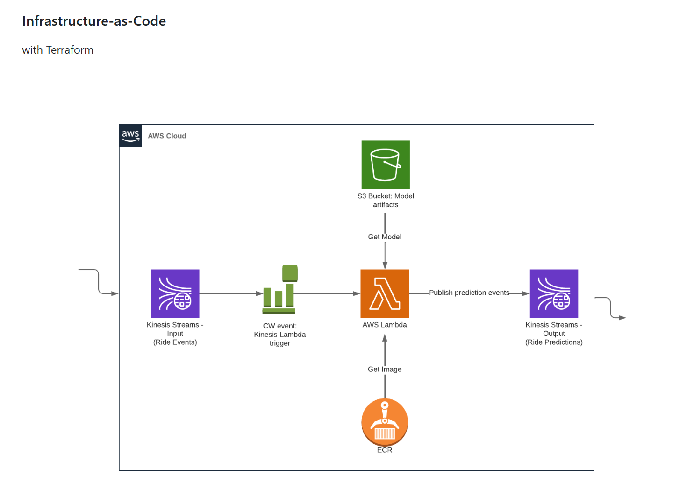
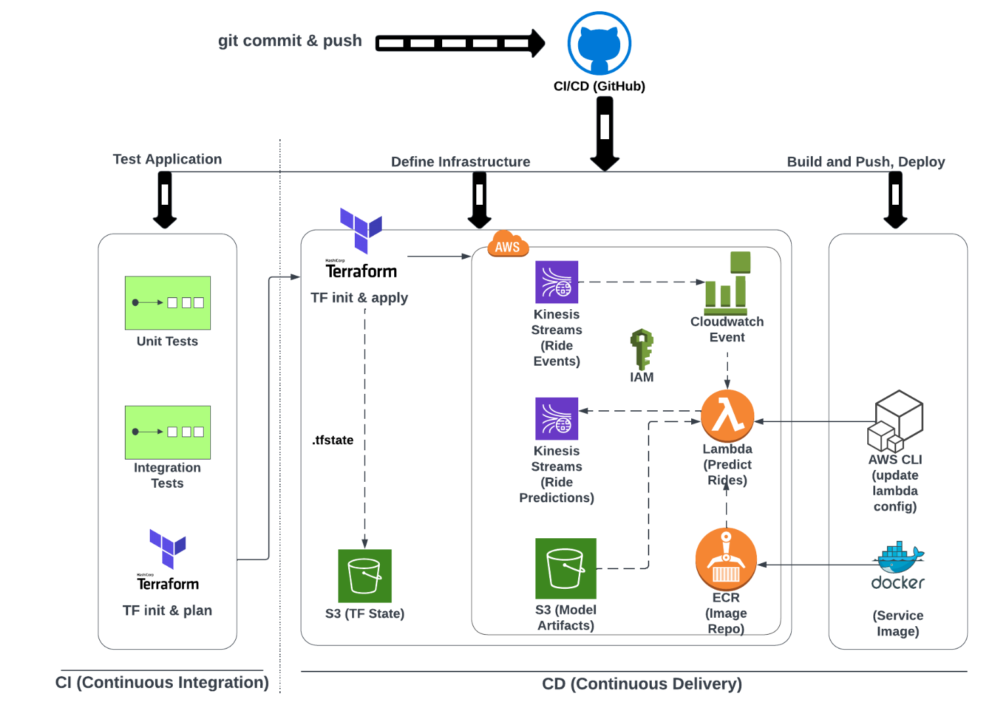

# Credit Card Fraud Detection

An end-to-end Machine Learning and MLOps project designed to build, deploy, and monitor a robust credit card fraud detection system.

---

## 📌 Project Overview
The primary objective of this project is to train and deploy a machine learning model capable of accurately classifying transactions as either legitimate or fraudulent. 

### 🎯 Purpose
This repository serves as a comprehensive, hands-on learning project to bridge the gap between traditional machine learning workflows and production-ready MLOps practices. The roadmap is divided into two distinct phases.
clea
### 🚀 Key Benefits & Value Add
* **Financial Risk Mitigation:** Minimizes monetary losses by identifying and blocking fraudulent activities in real-time before transactions clear.
* **Proactive Model Health Tracking:** Implements advanced monitoring to detect data drift and performance degradation early, preventing stale models from making bad predictions in production.
* **Scalable & Reproducible Infrastructure:** Utilizes Infrastructure as Code (IaC) and containerization, allowing the entire ecosystem to be destroyed, rebuilt, or scaled instantly across cloud environments.
* **Production-Grade Code Quality:** Enforces CI/CD pipelines, automated testing, and strict linting to ensure that codebase updates are reliable, secure, and deployment-ready without manual intervention.

---

## 🗺️ Project Roadmap

### Phase 1: Traditional Machine Learning
This phase focuses on the core data science workflow, moving from raw data to a containerized, reproducible script.
* **Data Collection & Ingestion:** Sourcing and loading the transaction dataset.
* **Exploratory Data Analysis (EDA):** Identifying patterns, correlation, and class imbalances.
* **Data Preprocessing:** Feature engineering, handling missing values, and scaling.
* **Model Training & Hyperparameter Tuning:** Evaluating multiple algorithms to find the optimal model.
* **Productionization:** Refactoring Jupyter notebooks into clean, modular Python scripts.
* **Environment Management:** Ensuring reproducibility using virtual environments (e.g., Virtualenv, Poetry, or Conda).
* **Containerization:** Packaging the application using Docker.

### Phase 2: MLOps & Production Engineering
This phase focuses on scaling, automating, deploying, and monitoring the model using industry-standard DevOps and MLOps tools.
* **Cloud Infrastructure:** Simulating production AWS cloud services locally using **LocalStack**, and provisioning these resources using Infrastructure as Code (IaC) via **Terraform**.
* **Experiment Tracking & Model Registry:** Logging parameters, metrics, and artifacts using **MLflow**.
* **CI/CD Pipeline:** Automating testing and deployment workflows.
* **Code Quality & Automation:** 
    * Implementing **Linters** and **Code Formatters** (e.g., Flake8, Black).
    * Using **Pre-commit hooks** to enforce code quality before commits.
    * Streamlining tasks with **Makefiles** and `make` commands.
* **Testing:** Writing robust **Unit Tests** and **Integration Tests** (e.g., using PyTest).
* **Deployment:** Serving the model as a production API.
* **Model Monitoring:** Tracking data drift and performance over time using **Evidently AI** and visualizing metrics via a **Grafana** dashboard.

---

## 🛠️ Tech Stack
* **Language:** Python
* **ML Libraries:** Scikit-Learn, Pandas, NumPy
* **MLOps & DevOps:** MLflow, Docker, Terraform, AWS
* **Monitoring:** Evidently AI, Grafana
* **CI/CD & Automation:** GitHub Actions, Pre-commit, Make

## Project Structure:
Project follows this structure:
* Infrastructure as Code (Iac): 
* CI/CD Pipeline: 


## ⚙️ How to Run the Project
Follow these exact steps to launch the entire environment, generate traffic, and view the automated telemetry calculations.

### 1. Prerequisites & Environment Setup
Ensure you have [Docker Desktop](https://www.docker.com/products/docker-desktop/) installed and running on your machine.

Next, install `uv` globally and sync all project dependencies cleanly into a localized virtual environment:

```bash
uv sync
uv run pre-commit install
```

### 2. Run the Verification Tests:
Before booting any infrastructure, run your automated unit tests to verify data transformation layouts and prediction boundaries:

```bash
make test
```

### 3. Launch the API Server:
To spin up your local live FastAPI inference server, execute the following command:

```bash
make serve
```

This starts the core inference API on port 8000 (http://127.0.0.1:8000/). Every time a client hits the `/predict` endpoint, the incoming payload is verified, scored by the XGBoost model, and simultaneously logged locally to `data/production_logs.csv` for downstream monitoring. You can access the interactive Swagger UI panel at http://127.0.0.1:8000/docs.

### 4. Monitoring:
In a **separate terminal window**, initialize the background metrics-parsing node:

```bash
make serve-monitor
```

This boots up our custom telemetry exporter running on port 8050 (http://127.0.0.1:8050/). When triggered, it invokes Evidently AI to pull fresh log entries from `data/production_logs.csv`, runs statistical tests against your training reference baseline, and formats those insights as a text metric payload exposed directly at http://127.0.0.1:8050/metrics.

In a **third terminal** split, spin up your time-series scraper and analytics visualization containers:

```bash
make prometheus-up
make grafana-up
```

### 5. Generate Real-Time Transaction Traffic:
To test the full automated loop, open a bash window and execute this loop to fire 15 sample transactions directly through your active FastAPI server to satisfy Evidently AI's minimum threshold requirements:

```bash
for i in {1..15}; do
  curl -s -X 'POST' \
    '[http://127.0.0.1:8000/predict](http://127.0.0.1:8000/predict)' \
    -H 'Content-Type: application/json' \
    -d '{
    "features": [-2.31, 1.95, -1.60, 3.99, -0.52, -1.42, -2.53, 1.39, -2.77, -2.77, 3.20, -2.89, -0.60, -4.28, 0.38, -1.14, -2.83, -0.01, 0.41, 0.12, 0.51, -0.03, -0.46, 0.32, 0.04, 0.17, 0.26,-0.14, -0.30, -0.99]
  }' > /dev/null
  echo "Sent transaction $i"
done
```

### 6. View Metric Logs:
Now, hit the evaluation endpoint in your browser to force your monitoring loop to execute statistical drift calculations on your new logs against your baseline training sets:
👉 http://127.0.0.1:8050/evaluate

Once completed, visit http://127.0.0.1:9090 to query your live `dataset_drift_status` and `drifted_features_count` variables inside the Prometheus interface dashboard!

### 7. Running via Docker:
To isolate the API server entirely into a production-grade container image package, you can skip local execution and run it completely self-contained:

```bash
make docker-build
make docker-run
```
